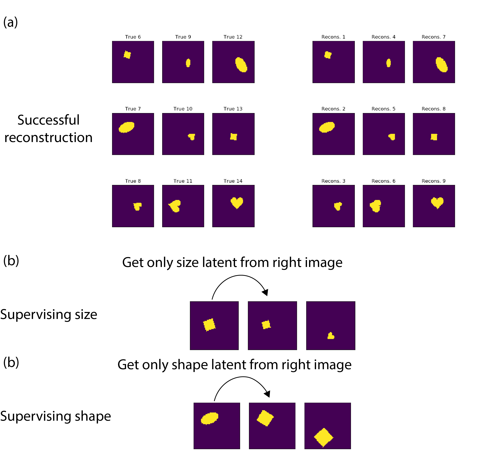

# representation-learning-project
Supervising disentangled variational auto encoder (SDVAE)
SDVAE has a variational auto encoder structure. Given some observations and some observed factors in the training set, it learns an encoder and decoder such that the encoder extracts latent factors in two sets: 1) highly predictive of the observed factor, 2) disentangled latent factors such that they are not predicitve of the observed factor. These two sets of latent factors, together, are a low-dimensional representation of the actual aobservations In inference, SDVAE learns these two sets of latent factors. Using the latent factors that are disentangled from the observed factors has applications in fairness in artificial intelligence (AI). 

A cool exapmle of this is: given some applications for a job or for a university program, you want to extract some low-dimensional latent factors to later build downstream neural networks that predicts applicant's eligibility for the job or the program. However, it is important to make sure these downstream neural newtworks are blind to applicant's gender or their race. Therefore, a set of low-dimensional latent factors can be exctracted by SDVAE such that they are minimally predicitve of race and gender and maximally summarize the applicant's application. Such latent factors are a good representation of the application, yet uncorrelated from gender and race, and thus could be used for any downstream prediction.

To run the SDVAE on the dsprites dataset, first download dsprites from [here](https://github.com/deepmind/dsprites-dataset). Pleae modify the dataset classs accordingly to be able to run on your machine.
After choosing the supervised target variable (e.g., 'size' or 'shape' or etc) in the "script_supevision.py", please run the following command make sure you set up the save directories in your script):
```
python script_supervision.py
```
the script will run and save the results. You can then run the script in the 'restore' format and evaluate your results. You should be able to get nice reconstructions and also be able to supervise latent factors like the image below:

